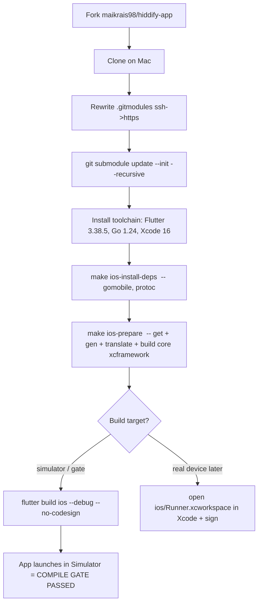

# feat: Hiddify-based Woman in Red — reach a verified iOS build on Mac

## Summary

Switch the project base from **Karing to Hiddify** and reach a **verified, unmodified iOS build on Mac** — the compile gate that must pass before any rebrand. Karing was abandoned because its VPN core glue package (`vpn_service`, `path: ../vpn-service/`) is not published (`KaringX/vpn-service` → 404), so the fork cannot `flutter pub get`, let alone build. Hiddify's core (`hiddify-core`) is a **public git submodule**, so the app builds from source.

This plan covers two staged pieces, matching the user's "do what's possible on Windows, the rest on Mac" split:
- **Windows (prep, no build):** fork `hiddify/hiddify-app`, set up the local repo, carry `design/` + `docs/sources/` across, clear the GPL/license gate.
- **Mac (build):** install the toolchain, clone with submodules, build the **unmodified** upstream Hiddify app for iOS. This closes the "upstream compiles" gate.

**Rebrand into "Woman in Red", Remnawave wiring, and TestFlight are explicitly out of scope here** — they come in a follow-up plan, only after the upstream build is green. This mirrors the bootstrap invariant: build upstream as-is *before* touching anything.

The Mac section is written as a **copy-paste-into-Codex** command sequence (Appendix A) — that is the artifact the user asked for.

---

## Problem Frame

The bootstrap contract picked Karing and assumed it was forkable+buildable. Research on the actual fork proved otherwise:

- Karing's `pubspec.yaml` links the VPN engine as `vpn_service: path: ../vpn-service/` — a local sibling directory that only exists on the maintainer's machine.
- `KaringX/vpn-service` returns 404 and is absent from KaringX's public repo list. The fork's `bind/` holds only Windows MSVC redistributable DLLs — no sing-box core, no iOS/macOS binding.
- Therefore `flutter pub get` fails immediately on a fresh clone, on **any** OS. Karing is source-available but **not self-buildable**.

Both research alternatives are buildable: `hiddify-core` (public, submodule) and `XTLS/libXray` (public). Hiddify was chosen for production: it carries VLESS+Reality+Hysteria2+TUIC in one core (matches a Remnawave subscription), has the largest community, and builds from source via a cross-platform `Makefile`.

**Residual risk carried into this plan:** Hiddify's license is `NOASSERTION` on GitHub — GPLv3 *with additional terms*. The bootstrap flagged this. Reading `LICENSE.md` in full is a **gate** (U2) before investing build effort, because the additional terms may constrain rebrand/store publication under a new name.

---

## Scope Boundaries

**In scope**
- Create and wire the `maikrais98/hiddify-app` fork (origin) with `hiddify/hiddify-app` as upstream.
- Establish the local working repo on a `brand/main` branch off upstream, carrying `design/` and `docs/sources/` forward.
- Read and record the Hiddify license terms (go/no-go gate).
- Install the pinned toolchain on Mac.
- Build the **unmodified** Hiddify app for iOS on Mac (simulator or `--no-codesign`) and confirm it launches.

**Out of scope — deferred to a follow-up plan**
- Rebrand to "Woman in Red" (name, bundle ids, icons, theme tokens from `design/`).
- Remnawave subscription wiring / onboarding screen.
- Apple Developer signing, Network Extension entitlement request, real-device run, TestFlight distribution.
- Android / Windows / Linux / macOS-desktop builds (iOS is the priority per the user).
- Authoring GitHub Actions release workflows.

**Deferred to Follow-Up Work**
- Decommission or archive the `maikrais98/karing` fork and the local Karing `brand/main` once Hiddify is confirmed building.

---

## Key Technical Decisions

**KTD-1 — Base = Hiddify (buildable core).** `hiddify-core` is a public submodule; Karing's core is private. Buildability outranks Karing's "cleaner license / smaller codebase" advantages, which are worthless if it can't compile. (see origin: docs/sources/VPN_OSS_Research.md)

**KTD-2 — Build upstream before rebrand.** First Mac deliverable is the *unmodified* Hiddify app building for iOS. Only after green do we rebrand. Prevents debugging rebrand errors and toolchain errors at the same time. (see origin: BOOTSTRAP_CLAUDE_CODE.md, Phase 2)

**KTD-3 — Fresh Hiddify repo, carry our layer over.** The local repo is currently Karing-based (`brand/main` = Karing + our `design/`/`docs/`). Rather than re-root the existing checkout again, clone the Hiddify fork clean on Mac and copy `design/` + `docs/sources/` into it. The Karing checkout stays as an archive branch until Hiddify is proven. Rationale: a clean Hiddify clone with correct submodule state is less error-prone than surgically swapping the entire tree in place.

**KTD-4 — Submodule URL must be rewritten ssh→https.** `.gitmodules` points `hiddify-core` at `ssh://git@github.com/hiddify/hiddify-core`. Without SSH keys the submodule fetch fails. Rewrite to `https://github.com/hiddify/hiddify-core.git` before `submodule update`. This is the single most common first-clone failure.

**KTD-5 — The Makefile DOWNLOADS a prebuilt core (verified on Mac) — pin it.** `make ios-prepare` **fetches a prebuilt `hiddify-core`**, it does not build it from source, so no Go/gomobile is needed. ⚠️ Without `CHANNEL=prod` it pulls a **mutable draft** core whose Swift API can be incompatible with the app; pin the **official core `v4.1.0`** (or `CHANNEL=prod`) for a stable, API-compatible build. This corrects the pre-execution assumption that the core was compiled via gomobile.

---

## Toolchain (pinned — do not use "latest")

| Tool | Version | Source of truth | Notes |
|---|---|---|---|
| Flutter | `3.38.5` (stable, `^3.38.5`) | `pubspec.yaml` `environment.flutter` | Bundles the required Dart |
| Dart | `3.10.4` (`^3.10.4`) | `pubspec.yaml` `environment.sdk` | Comes with Flutter 3.38.5 |
| Go | **not required for the app build** | — | ⚠️ Correction (verified on Mac): `make ios-prepare` **downloads a prebuilt core**, it does not compile it. No Go/gomobile needed. |
| Xcode | `16.x` | Flutter 3.38 requirement | Real device build needs a paid Apple Developer account (deferred) |
| CocoaPods | ships with Xcode / `gem` | `ios/Podfile` | `pod install` run by Flutter |
| protoc + gomobile | installed by `make *-install-deps` | `Makefile` | Do not install manually first |
| Hiddify core | `core.version=4.1.0` | `dependencies.properties` | Pinned by the app repo |

---

## High-Level Build Flow (Mac)



The compile gate is **I** — the app building and launching in the iOS Simulator with no code signing. Real-device / VPN-tunnel testing (J) is deferred because it requires the Apple Developer account and the Network Extension entitlement.

---

## Implementation Units

### U1. Fork Hiddify and set up the local repo (Windows)

**Goal:** `maikrais98/hiddify-app` exists as a fork of `hiddify/hiddify-app`; a local working copy is ready on a branch that tracks upstream, with our `design/` and `docs/sources/` carried across.

**Dependencies:** none.

**Files:** git remotes/branches; carry over `design/`, `docs/sources/`, `BOOTSTRAP_CLAUDE_CODE.md`.

**Approach:**
- Create the fork: `gh repo fork hiddify/hiddify-app --clone=false` (requires the user's explicit go-ahead — public-repo creation).
- Preferred (clean, KTD-3): clone fresh into a new working directory on whichever machine will build, set `origin = maikrais98/hiddify-app`, `upstream = hiddify/hiddify-app`, create `brand/main` off `upstream/main`, then copy `design/` and `docs/sources/` in and commit.
- The existing Karing checkout and `maikrais98/karing` remain untouched as an archive.

**Verification:** `gh api repos/maikrais98/hiddify-app` returns the fork with `parent = hiddify/hiddify-app`; local `git remote -v` shows origin=fork, upstream=hiddify; `design/` and `docs/sources/` present on `brand/main`.

**Test expectation:** none — repo/scaffolding setup, no runtime behavior.

---

### U2. License gate — read Hiddify's GPLv3 "additional terms" (Windows)

**Goal:** A go/no-go decision on whether Hiddify's license permits our rebrand + private TestFlight distribution under a new name, recorded in `docs/gpl-compliance.md`.

**Dependencies:** U1.

**Files:** `LICENSE.md` (read), `docs/gpl-compliance.md` (write).

**Approach:**
- Read `LICENSE.md` and any `COPYING`/`NOTICE` fully. The GitHub label is `NOASSERTION` = GPLv3 + extra clauses.
- Record: attribution requirements, any restriction on re-publishing under a different name, any Actions/build-transparency clause.
- If a clause blocks rebrand-and-distribute, **stop and escalate to the user** before build effort — OneXray (clean GPL-3.0) is the fallback base.

**Verification:** `docs/gpl-compliance.md` states the additional terms in plain language and a clear go/no-go verdict for our use case.

**Test expectation:** none — research/decision gate.

---

### U3. Install the pinned toolchain (Mac)

**Goal:** Flutter 3.38.5, Go 1.24, Xcode 16.x, and Make available and passing `flutter doctor`.

**Dependencies:** U1.

**Files:** none (environment).

**Approach:**
- Flutter 3.38.5 via the official SDK (or `fvm use 3.38.5`), on `PATH`.
- Go 1.24 (matches `hiddify-core/go.mod`).
- Xcode 16.x from the App Store; run `xcodebuild -runFirstLaunch`; accept the license.
- Do **not** pre-install gomobile/protoc — `make *-install-deps` handles them (KTD-5).
- `flutter doctor -v` should show Flutter + Xcode green (Android may be red — irrelevant for iOS).

**Verification:** `flutter --version` shows 3.38.5 / Dart 3.10.x; `go version` shows go1.24; `xcodebuild -version` shows 16.x; `flutter doctor` iOS toolchain green.

**Test expectation:** none — environment setup.

---

### U4. Build the unmodified upstream app for iOS — the compile gate (Mac)

**Goal:** The **unmodified** Hiddify app builds and launches in the iOS Simulator. This is the gate that proves the base is buildable.

**Dependencies:** U1, U3 (U2 as a go/no-go gate before starting).

**Files:** `.gitmodules` (rewrite url), generated build artifacts under `build/`, `ios/`.

**Approach:**
- Init the submodule after rewriting ssh→https (KTD-4): `git submodule update --init --recursive`.
- `make ios-install-deps` — installs gomobile/protoc and iOS build deps.
- `make ios-prepare` — runs `get` (`flutter pub get`), `gen` (build_runner codegen), `translate`, and **downloads** the prebuilt `hiddify-core` framework (`ios-libs`). Pin core `v4.1.0` / `CHANNEL=prod` (see KTD-5) — the default draft channel can break the Swift API.
- `flutter build ios --debug --no-codesign`, or launch on a booted Simulator with `flutter run`.
- No source changes. If it fails, fix environment/submodule/make issues only — never patch app code to force a build.

**Approach note:** the exact, ordered command list is in **Appendix A** (Codex-ready).

**Verification (outcomes, not code):**
- `git submodule status` shows `hiddify-core` checked out at branch `v3`, no `-`/`+` prefix.
- `make ios-prepare` completes without error and produces the core framework under `ios/`.
- `flutter build ios --no-codesign` exits 0, **or** the app launches in the iOS Simulator.
- App opens to Hiddify's home screen (unbranded) — this is expected; rebrand is a later plan.

**Test scenarios (build-verification, not unit tests):**
- Happy path: clean clone → submodule init → `make ios-prepare` → `flutter build ios --no-codesign` succeeds.
- Failure path (submodule): if `submodule update` fails with an SSH/permission error, the `.gitmodules` url was not rewritten to https — fix and retry.
- Failure path (toolchain): if `make ios-prepare` fails on `gomobile`/`protoc`, `make ios-install-deps` did not complete — rerun it and inspect its output.
- Failure path (version skew): if `flutter pub get` errors on the Dart SDK constraint, the Flutter version is not 3.38.5 — correct it (U3).

---

### U5. (Deferred stub) Real-device / TestFlight path — do not start yet

**Goal:** Placeholder marking what comes after the gate, so it is visible but explicitly not-now.

**Dependencies:** U4 green.

**Approach:** Requires a paid Apple Developer account, the **Network Extension entitlement** (apply early — approval is slow), App ID + App Group for `HiddifyPacketTunnel`, signing. Covered by a follow-up plan alongside rebrand. Listed here only so the entitlement application can be started in parallel if desired.

**Test expectation:** none — deferred marker.

---

## Risks & Mitigations

- **License blocks rebrand (medium/high impact).** GPLv3 + additional terms may restrict store distribution under a new name. → U2 is a hard gate before build effort; OneXray is the clean-license fallback.
- **Submodule SSH failure on first clone (high likelihood, low impact).** → KTD-4 rewrite to https; documented in Appendix A.
- **gomobile/protoc setup friction on Mac (medium).** → Use `make *-install-deps` (KTD-5); do not hand-roll.
- **Flutter 3.38.5 is recent (low/medium).** → Pin exactly; do not take "latest". Use fvm if juggling versions.
- **Network Extension entitlement lead time (schedule).** → Can apply during U2–U4 in parallel (U5 note).
- **iOS core build is Mac-only.** → Accepted; Windows does prep (U1–U2) only.

---

## Open Questions

- **License verdict (U2)** — blocks committing to Hiddify. If the additional terms forbid rebranded distribution, revisit base (OneXray).
- **Simulator vs real device for the gate** — plan targets Simulator/`--no-codesign` (no Apple account needed). Confirm that satisfies "compiled on Mac" for now; real-device VPN testing is deferred with signing.
- **Remnawave protocol set** — if the subscription only serves VLESS/Reality, OneXray would also suffice; Hiddify keeps Hysteria2/TUIC open for later. Not blocking.

---

## Appendix A — Codex-ready Mac build sequence (unmodified upstream)

> Paste into Codex on the Mac. Assumes Homebrew present. Run from an empty working directory. Replace nothing except where noted. Goal: build the **unmodified** Hiddify app for iOS. Do **not** edit app source to force a build — only fix environment/submodule/make issues.

```bash
# 0. Prerequisites (skip any already installed)
#    - Xcode 16.x from the App Store, then:
sudo xcodebuild -license accept
xcodebuild -runFirstLaunch
#    - Go 1.24 and Flutter 3.38.5:
brew install go            # ensure `go version` reports go1.24.x; else install go1.24 explicitly
#    Flutter 3.38.5 (via fvm recommended):
brew install fvm || true
fvm install 3.38.5 && fvm global 3.38.5
export PATH="$HOME/fvm/default/bin:$PATH"   # or add fvm/flutter to PATH per your setup
flutter --version          # must show 3.38.5 / Dart 3.10.x
flutter doctor -v          # iOS toolchain must be green (Android may be red — ignore)

# 1. Clone YOUR fork (create it first: gh repo fork hiddify/hiddify-app --clone=false)
git clone https://github.com/maikrais98/hiddify-app.git
cd hiddify-app

# 2. Point the core submodule at HTTPS (it defaults to ssh and will fail without keys)
git config -f .gitmodules submodule.hiddify-core.url https://github.com/hiddify/hiddify-core.git
git submodule sync
git submodule update --init --recursive
git submodule status        # hiddify-core should be checked out (branch v3), no leading - or +

# 3. Install iOS build deps (gomobile, protoc, etc.) via the project's own targets
make ios-install-deps

# 4. Prepare: pub get + codegen + translations + build the core into an iOS framework
make ios-prepare

# 5. Build the app for iOS WITHOUT code signing (the compile gate)
flutter build ios --debug --no-codesign

# 6. OR run it in the Simulator to see it launch:
open -a Simulator
flutter run                 # pick the booted iOS simulator

# SUCCESS = step 5 exits 0, or step 6 launches the (unbranded) Hiddify home screen.
# If step 2 errors with SSH/permission  -> the .gitmodules rewrite didn't take; redo step 2.
# If step 4 errors on gomobile/protoc    -> rerun step 3 and read its output.
# If step 4 errors on the Dart SDK bound  -> Flutter isn't 3.38.5; fix step 0.
```

**After the gate passes:** report back — the next plan covers rebrand to "Woman in Red" (bundle ids `com.womaninred.*`, NE target `HiddifyPacketTunnel` → `com.womaninred.app.ne`, theme tokens from `design/`), Remnawave wiring, and the Apple Developer / TestFlight path.
