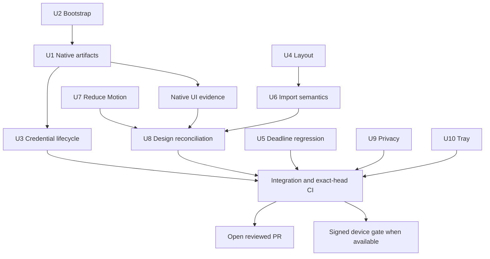
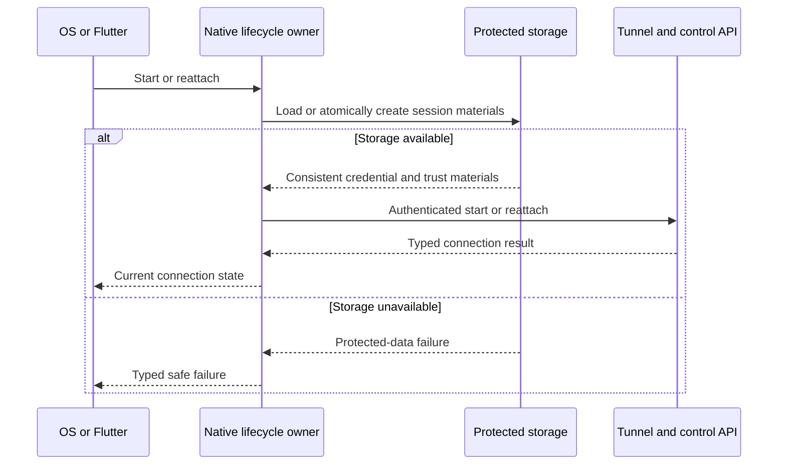
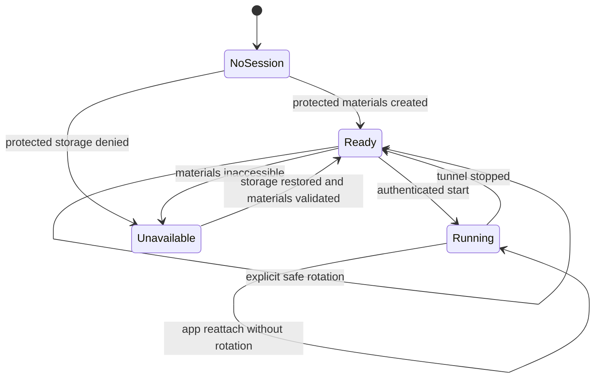

# Woman in Red Audit Remediation - Plan

## Goal Capsule

**Objective:** устранить десять подтверждённых дефектов аудита и передать проверяемый кандидат Woman in Red для испытания VPN на физическом iPhone.

**Means:** отдельная задача на каждое исправление, изолированные worktrees и единая интеграция по KTD1–KTD3.

**Authority:** текущие инструкции пользователя имеют приоритет над этим планом; этот документ определяет исполнение F01–F10 вместо организационной части origin. Исходный план сохраняется как история.

**Execution profile:** основной координатор завершает интеграцию, review, проверку CI и PR. Исполнители владеют своими U-ID до передачи коммита и evidence. Учёт прогресса ведётся в задачах и Git, а не изменением этого плана.

**Stop conditions:** противоречие продуктовым ограничениям, необходимость отключить защиту или изменить неразрешённую инфраструктуру останавливает затронутую единицу. Отсутствие подписания или физического device evidence оставляет соответствующий gate открытым и не запрещает безопасную доставку кода.

---

## Product Contract

### Summary

Исправить native build и bootstrap, обеспечить credentials при системном запуске VPN, закрыть утечку импортируемой конфигурации и пять UI/test/tray дефектов. Сверить необходимые экраны pen.dev и статусы Miro с проверенной реализацией. Передать изменения в открытом PR с раздельными результатами кодовых и физических VPN-проверок.

### Problem Frame

Аудит исходного SHA `884ce69fc8dcc1e0468ceb4bae931c9036f03cc9` обнаружил F01–F10. Успех тестов Flutter и Go не доказывает происхождение packaged native core, работоспособность системного запуска tunnel или пригодность интерфейса при крупном тексте. Исходный checkout содержит пользовательские изменения Xcode project и core submodule.

### Requirements

**Native and privacy**

- R1. F01: Simulator и unsigned iOS Release собираются из воспроизводимых patched sources, а packaged control API подтверждает auth/TLS/pinning.
- R2. F02: публичные вложенные зависимости доступны из чистого checkout без пользовательских SSH credentials и без изменения глобального Git config.
- R3. F03: app restart, iOS On Demand и Android tile/service используют согласованные защищённые connection materials без зависимости от transient Flutter initialization.
- R9. F09: ошибочная импортируемая конфигурация не попадает в logging, file printer и telemetry conversion.

**Interaction and regression evidence**

- R4. F04: hero и ручной импорт сохраняют доступные действия при малом экране, 2× тексте и открытой клавиатуре.
- R5. F05: deadline/shared-budget regression проверяется детерминированно и сохраняет ограничение общего времени запросов.
- R6. F06: кнопка возврата к вариантам импорта имеет локализованное доступное имя.
- R7. F07: общий route transition соблюдает системный Reduce Motion, сохраняя навигацию.
- R8. F08: необходимые pen.dev экраны и design tokens отражают проверенную реализацию без нового редизайна.
- R10. F10: неудачный latency probe не меняет Connected на Connecting и не скрывает Disconnect в desktop tray.

**Delivery boundaries**

- R11. Каждый F01–F10 имеет отдельную Codex задачу, тематический коммит и собственную проверку; изменения передаются в открытом PR без merge.
- R12. Miro и repository evidence описывают только подтверждённый уровень готовности; код, Simulator UI и физический VPN runtime различаются.
- R13. Auth, TLS, pinning, deadlines и On Demand сохраняются; подписки, реальные credentials и device identifiers не попадают в общие evidence.

### Scope Boundaries

Аккаунты, billing, recovery, family sharing, pre-purchase checker и новые VPN/backend возможности не входят в исправление аудита. Действуют `docs/product/business-contract-decision.md` и `docs/product/later-visual-pilot-gate.md`. Новые light/map/presets, трёхтабовая IA и продуктовый редизайн не добавляются.

### Deferred to Follow-Up Work

TestFlight/Store публикация, администрирование release environments и внешняя публикация native artifacts требуют отдельного release scope. Подписанное испытание возможно только при фактически доступных identities, provisioning и entitlements.

**Product Contract preservation:** смысл исправлений F01–F10 сохранён. Текущая авторизация заменяет прежний лимит двух потоков и отложенную синхронизацию F08; merge и выпуск не добавлены.

---

## Planning Contract

### Key Technical Decisions

- KTD1. **Одна задача и одна единица на F-ID.** U1–U10 соответствуют F01–F10 без перенумерации. Использовать отдельные worktrees от локального audit baseline, сохраняя исходный dirty checkout. KVN — контейнер проекта; Git repository находится в `hiddify-app`.
- KTD2. **Ограниченный параллелизм.** Не более четырёх активных исполнителей. Native builds и full Flutter suite получают один общий ресурсный слот, чтобы нагрузка не подменяла диагностику timing failures. Раздельные Codex задачи заменяют прежний двухпоточный режим по текущей авторизации пользователя.
- KTD3. **Один интеграционный PR.** Координатор собирает тематические коммиты в отдельной ветке пользовательского fork `maikrais98/hiddify-app`. Предпочтительная база — `checkpoint/mvp-before-dark-theme`; перед открытием проверить актуальные base/head и включение локального baseline. Не смешивать исправляющий diff со всей историей PR #1. Push и открытие PR разрешены, merge не разрешён.
- KTD4. **Контракт источника и binary един.** U2 устраняет transport blocker до итоговой приёмки U1. U1 закрепляет core/sing-box revision, patch digest, toolchain и artifact digest; U3 использует этот контракт. Маркер строки в binary не заменяет packaged RPC proof.
- KTD5. **Native владеет жизненным циклом credential.** U3 выбирает protected storage и правила generation/rotation/recovery на основании реальных app/extension capabilities. App Group не означает автоматически общий Keychain access. Недоступное защищённое хранилище даёт типизированный отказ без plaintext fallback (R3, R13).
- KTD6. **Проверенная реализация задаёт F08.** После U4/U6/U7 U8 синхронизирует только затронутые экраны и tokens. Для Auto Mode сохранить текущее проверенное поведение и устранить противоречивые представления; новый продуктовый выбор не требуется (R8).
- KTD7. **У каждого общего файла один текущий владелец.** U2 передаёт `.github/workflows/build.yml` U1 после коммита. U1 передаёт ADR 0007 и возможные изменения `ios/Runner.xcodeproj/project.pbxproj` U3. U4 передаёт import modal и import tests U6. Координатор единолично меняет общий baseline, итоговый checklist, PR description и Miro. Новую общую правку сначала передать владельцу, затем интегрировать.

### High-Level Technical Design

U3 architecture research may start read-only beside U1; implementation begins after U1. Native screenshots are preferred for U8; if U1 remains blocked, U8 may reconcile against verified widget evidence but must label native typography/runtime as unverified.

U3 finalises the exact lifecycle transitions and ownership in ADR 0007; these diagrams establish the required failure and reattach boundaries, not storage API signatures.

### Assumptions and Evidence Boundaries

Audit results are historical inputs, not freshly repeated results: sequential Flutter 357/357, analyzer baseline 228, Go hcore/localauth including race PASS, unsigned iOS build FAIL, zero valid signing identities. Actual device/signing availability is rechecked during integration. Flutter 3.38.5 is the origin toolchain; Xcode 26.6 was used by the audit and U1 must resolve the historical 16.x pin against supported source/binary evidence.

The ephemeral audit report must be reduced to an anonymised repository baseline by the coordinator before its temporary files disappear. Build logs, frameworks and DerivedData remain outside Git. No measured token-saving percentage is assumed; model choice follows risk and actual rework.

### Execution Ownership

| Unit | Task owner model / effort | Exclusive scope or handoff |
|---|---|---|
| U1 | GPT-5.6 Sol / high | Swift adapter, source/artifact packaging; shared workflow after U2, ADR before U3 |
| U2 | GPT-5.6 Sol / high | Bootstrap transport and release bootstrap gate |
| U3 | GPT-6 Astra / medium architecture; GPT-5.6 Sol / high implementation | Mobile credentials and lifecycle; ADR after U1 |
| U4 | GPT-5.6 Sol / medium | Hero and modal layout, then hand modal/tests to U6 |
| U5 | GPT-5.6 Sol / medium | Parser timing test and minimal clock seam |
| U6 | GPT-5.6 Sol / medium | Import semantics and required localization after U4 |
| U7 | GPT-5.6 Sol / medium | Shared transition and dedicated regression |
| U8 | GPT-5.6 Luna / xhigh | Design reconciliation after UI evidence; escalate substantive UI code to Sol medium |
| U9 | GPT-5.6 Sol / medium | Import log sinks and privacy regression |
| U10 | GPT-5.6 Sol / medium | Tray state/menu and dedicated regression |

Use Astra low for one focused native/privacy review when the integrated diff is available. Record model/effort, result and rework count; use token counts only when directly available. Account limits do not measure per-task cost.

---

## Implementation Units

| U-ID | Title | Primary files | Depends on |
|---|---|---|---|
| U1 | F01 Native artifact contract | `ios/HiddifyPacketTunnel/SingBox/ExtensionPlatformInterface.swift`, `Makefile` | U2 for final integration |
| U2 | F02 Clean bootstrap | `scripts/apply_hiddify_core_patch.sh` | — |
| U3 | F03 Credential lifecycle | `ios/Runner/VPN/VPNManager.swift`, `lib/hiddifycore/core_interface/core_interface_mobile.dart` | U1 implementation contract |
| U4 | F04 Responsive layouts | `lib/features/home/widget/nova_ritual_hero.dart`, `lib/features/profile/add/add_profile_modal.dart` | — |
| U5 | F05 Deadline test | `test/features/profile/data/profile_parser_test.dart` | — |
| U6 | F06 Import semantics | `lib/features/profile/add/add_profile_modal.dart` | U4 |
| U7 | F07 Reduce Motion | `lib/core/router/go_router/helper/custom_transition.dart` | — |
| U8 | F08 Design parity | `design/tokens/colors.css`, `lib/core/theme/nova_tokens.dart` | U4, U6, U7; native evidence gate from U1 |
| U9 | F09 Privacy sinks | `lib/features/settings/notifier/config_option/config_option_notifier.dart` | — |
| U10 | F10 Tray state | `lib/features/system_tray/notifier/system_tray_notifier.dart` | — |

### U1. F01 Native Artifact Contract

**Goal:** выполнить R1 с проверяемым происхождением native binary.

**Requirements:** R1, R13; KTD1–KTD4, KTD7.

**Dependencies:** U2 до итогового bootstrap/build; раннее исследование допустимо без изменения его файлов.

**Files:** `ios/HiddifyPacketTunnel/SingBox/ExtensionPlatformInterface.swift`, `Makefile`, `dependencies.properties`, `.github/workflows/build.yml`, `scripts/download_core_archive.sh`, `docs/adr/0007-local-control-authentication.md`, `test/security/core_archive_integrity_test.sh`; добавить `test/security/packaged_core_auth_test.sh` для реального packaged RPC probe.

**Approach:** сверить Libbox protocol с выбранными исходниками, реализовать необходимые neighbor/interface callbacks осмысленно и адаптировать DNS iterator. Закрепить provenance по KTD4; выбрать поддерживаемую toolchain без случайного отката SDK. Xcode project из исходного dirty checkout не переносить автоматически. Для передачи U3 установить поведение повторного native setup, остановки control listener и certificate/pin при сохранённом secret; записать поддержанные операции и ограничения.

**Patterns to follow:** существующие archive integrity gates и ADR 0007.

**Test scenarios:**

- Пустой build cache даёт Simulator и unsigned Release из ожидаемого artifact digest.
- Неверный archive digest или source revision отклоняется до использования framework.
- Correct credential проходит RPC на packaged core; missing/wrong credential отклоняется.
- Неверный TLS peer/pin отклоняется, trust к постороннему endpoint не расширяется.
- Повторный setup с тем же secret показывает фактическое поведение listener и certificate/pin; handoff не предполагает их неизменность.
- Shutdown/re-setup проверяет отсутствие прежнего listener; если API не поддерживает shutdown, handoff явно требует restart процессов вместо обещания live rotation.

**Verification:** обе native сборки, source/artifact manifest, packaged auth evidence и проверенный lifecycle handoff для U3. Неполный packaged proof оставляет U1 Partial даже при успешной компиляции.

### U2. F02 Clean Bootstrap

**Goal:** выполнить R2 из чистого checkout.

**Requirements:** R2; KTD1–KTD4, KTD7.

**Dependencies:** нет.

**Files:** `scripts/apply_hiddify_core_patch.sh`, `test/ci/release_gate_test.sh`, `.github/workflows/build.yml`; вложенные `.gitmodules` обрабатывать воспроизводимым bootstrap, а не незакоммиченным локальным изменением.

**Approach:** repository-scoped HTTPS для публичных nested dependencies с сохранением pinned revisions и fail-fast проверки базового SHA.

**Patterns to follow:** текущий apply-patch и release gate.

**Test scenarios:**

- Чистый checkout без SSH agent/keys выполняет clone/init/patch/dependency resolution.
- Повторное применение bootstrap не дублирует patch.
- Неверный исходный SHA отклоняется.
- Полученные исходники допускают запуск Go hcore/localauth checks.

**Verification:** реальный clean bootstrap и CI evidence; проверка строки `recursive` сама по себе не является приёмкой. Передать workflow U1.

### U3. F03 Native Credential Lifecycle

**Goal:** выполнить R3 при system-driven start и surviving tunnel.

**Requirements:** R3, R13; KTD1–KTD5, KTD7.

**Dependencies:** U1 до реализации; архитектурная проверка read-only может идти параллельно. Handoff U1 должен установить идемпотентность native setup, способ остановки control listener и получение certificate/pin при повторном setup с тем же secret.

**Files:** `lib/hiddifycore/core_interface/core_interface_mobile.dart`, `ios/Runner/VPN/VPNManager.swift`, `ios/HiddifyPacketTunnel/SingBox/ExtensionProvider.swift`, `android/app/src/main/kotlin/com/hiddify/hiddify/Settings.kt`, `android/app/src/main/kotlin/com/hiddify/hiddify/MethodHandler.kt`, `android/app/src/main/kotlin/com/hiddify/hiddify/bg/TileService.kt`, `android/app/src/main/kotlin/com/hiddify/hiddify/bg/BoxService.kt`, `docs/adr/0007-local-control-authentication.md`, `test/hiddifycore/native_initialization_failure_test.dart`; добавить `test/hiddifycore/native_credential_lifecycle_test.dart` и platform lifecycle harness там, где выбранный storage требует native evidence.

**Additional files:** новые `ios/Shared/LocalControlCredentialStore.swift` и `android/app/src/main/kotlin/com/hiddify/hiddify/LocalControlCredentialStore.kt`; `ios/Runner/Handlers/MethodHandler.swift`, `ios/Runner.xcodeproj/project.pbxproj`, `android/app/src/main/kotlin/com/hiddify/hiddify/utils/GrpcProvider.kt`, `android/app/src/main/kotlin/com/hiddify/hiddify/bg/VPNService.kt` в пределах credential contract.

**Approach:** документировать владельца, защищённое хранение, locked-device behavior, rotation, cleanup и reattach. Flutter получает согласованные материалы от native lifecycle. Сохранить типизированные ошибки по текущим native failure tests. Новые entitlements или project settings менять только в worktree и лишь по выбранному обоснованному storage contract. Обычный disconnect сохраняет поколение. Не добавлять live rotation: замена допустима только после подтверждённой остановки tunnel и прежних listeners; если shutdown недоступен, требуется явный restart процессов. Missing/corrupt storage при потенциально живом tunnel ведёт к recovery, а не автоматической подмене credential.

**Patterns to follow:** typed failures в ExtensionProvider и existing native Dart regression tests.

**Test scenarios:**

- iOS start с `options == nil` получает существующие защищённые материалы.
- Flutter restart при живом tunnel не создаёт несовместимый secret.
- Android tile/service запускается без предварительной Flutter initialization.
- Одновременные старты получают одну согласованную сессию.
- Недоступное protected storage даёт безопасный typed failure.
- После предусмотренной rotation устаревший credential отклоняется.

**Verification:** native/Dart contract tests и lifecycle matrix; signed device replay остаётся отдельным gate, mocks не подтверждают Keychain sharing или On Demand runtime.

### U4. F04 Responsive Hero and Import

**Goal:** выполнить R4 без ухудшения базового интерфейса.

**Requirements:** R4; KTD1, KTD2, KTD7.

**Dependencies:** нет; нативные screenshots после U1.

**Files:** `lib/features/home/widget/nova_ritual_hero.dart`, `lib/features/profile/add/add_profile_modal.dart`, `test/features/profile/add/import_flow_test.dart`, `test/core/ui_04_responsive_assistive_smoke_test.dart`.

**Approach:** сделать hero адаптивным, modal scrollable и keyboard-safe; воспроизводить actual modal route и production provider wiring.

**Patterns to follow:** existing import flow и UI-04 fixtures.

**Test scenarios:**

- При 320×568 и 2× тексте hero не переполняется, primary action доступен и нажимается.
- Ручной импорт при 568×320 и keyboard inset 180 допускает заполнение и submit.
- Режим 1× сохраняет базовые layout и действия.

**Verification:** targeted fixtures с реальными actions и baseline screenshots; затем Simulator screenshot с native typography. Передать modal/import tests U6.

### U5. F05 Deterministic Deadline Regression

**Goal:** выполнить R5 без ослабления общего deadline.

**Requirements:** R5, R13; KTD1, KTD2.

**Dependencies:** нет.

**Files:** `test/features/profile/data/profile_parser_test.dart`; при необходимости только минимальный clock/barrier seam в `lib/features/profile/data/profile_parser.dart`.

**Approach:** управляемые часы или барьер вместо wall-clock scheduling. Не ограничиваться увеличением timeout; parser security semantics не менять.

**Patterns to follow:** текущие parser budget tests и existing download security coverage.

**Test scenarios:**

- Первый запрос расходует часть бюджета, второй получает остаток.
- Исчерпанный бюджет запрещает следующий запрос.
- Планировщик не делает assertion зависимым от скорости хоста.

**Verification:** focused test и обычный parallel full suite устойчивы; широкие проверки выполняет координатор.

### U6. F06 Named Import Control

**Goal:** выполнить R6 для возврата из ручного ввода.

**Requirements:** R6; KTD1, KTD2, KTD7.

**Dependencies:** U4 и его commit.

**Files:** `lib/features/profile/add/add_profile_modal.dart`, `assets/translations/en.i18n.json`, `assets/translations/ru.i18n.json`, необходимые generated translations, `test/features/profile/add/import_flow_test.dart`.

**Approach:** локализованное имя должно описывать фактический переход к вариантам импорта, а не закрытие всего flow.

**Patterns to follow:** existing translations и semantics assertions.

**Test scenarios:**

- В RU и EN semantics содержит понятное непустое имя кнопки.
- Нажатие возвращает к вариантам импорта.
- После добавления имени сохранены U4 layout/action checks.

**Verification:** production widget semantics/action regression; native VoiceOver отдельно.

### U7. F07 Reduced Motion Routes

**Goal:** выполнить R7 в общем helper.

**Requirements:** R7; KTD1, KTD2.

**Dependencies:** нет.

**Files:** `lib/core/router/go_router/helper/custom_transition.dart`; добавить `test/core/router/go_router/helper/custom_transition_test.dart`.

**Approach:** учитывать системный accessibility signal на route boundary, сохраняя обычный transition, когда Reduce Motion выключен.

**Patterns to follow:** existing `CustomTransitionPage` и Flutter accessibility settings patterns в UI tests.

**Test scenarios:**

- Включённый Reduce Motion не запускает пространственный переход для slide route.
- Выключенный режим сохраняет предусмотренный переход.
- Push и pop завершаются с правильным экраном и focus/navigation behavior.

**Verification:** regression на enabled/disabled режимах и свежая ручная native проверка при доступности.

### U8. F08 Design Reconciliation

**Goal:** выполнить R8 с доказуемой связью между design и runtime.

**Requirements:** R8, R12; KTD1, KTD2, KTD6, KTD7.

**Dependencies:** U4, U6, U7; источник native evidence по U1 и оговорке HTD.

**Files:** `design/tokens/colors.css`, `lib/core/theme/nova_tokens.dart`, `lib/features/proxy/overview/proxies_overview_page.dart` только при доказанном расхождении; добавить `docs/release/f08-design-reconciliation.md`. Внешние artifacts: только нужные pen.dev screens; Miro меняет координатор.

**Approach:** составить точный diff Auto Mode/tokens/screens, записать ссылку или ID существующего canvas и состояния до правки. Синхронизировать с проверенными screens по KTD6. Не перерисовывать соседние страницы.

**Test expectation:** новые unit tests не требуются для одной сверки документации/дизайна; если меняется production behavior, передать scoped изменение Sol и добавить соответствующий widget regression.

**Verification:** screenshots before/after, canvas IDs, token mapping и ссылочная evidence в документе. Отсутствующий доступ к pen.dev означает blocked external artifact, не Done.

### U9. F09 Safe Config Import Errors

**Goal:** выполнить R9 на реальном import path.

**Requirements:** R9, R13; KTD1, KTD2.

**Dependencies:** нет.

**Files:** `lib/features/settings/notifier/config_option/config_option_notifier.dart`, `lib/features/per_app_proxy/overview/per_app_proxy_notifier.dart`, `lib/features/per_app_proxy/data/app_proxy_data_source.dart` при подтверждённом source-bearing sink; проверить `lib/core/logger/custom_logger.dart`, `lib/core/analytics/analytics_logger.dart`; добавить `test/security/config_import_logging_test.dart`.

**Approach:** synthetic canary вызывает реальные clipboard/file handlers и parse/update failures. Заменить raw source/exception на bounded failure codes только в затронутых путях; сохранить понятное сообщение пользователю.

**Patterns to follow:** `test/security/safe_diagnostics_test.dart` и безопасный diagnostic export.

**Test scenarios:**

- Повреждённый JSON с canary воспроизводит текущую утечку до fix.
- После fix marker отсутствует в LogRecord, file printer и Sentry breadcrumb conversion.
- Clipboard и file import failures проверяются через production handlers.
- Safe diagnostics сохраняет redaction и полезную классификацию ошибки.

**Verification:** regression проверяет реальные sinks, не копию `jsonDecode`; настоящая отправка в Sentry не нужна.

### U10. F10 Truthful Desktop Tray

**Goal:** выполнить R10 при отказе измерения latency.

**Requirements:** R10; KTD1, KTD2.

**Dependencies:** нет.

**Files:** `lib/features/system_tray/notifier/system_tray_notifier.dart`; добавить `test/features/system_tray/notifier/system_tray_notifier_test.dart`.

**Approach:** разделить connection state и latency presentation. Не менять state contracts других экранов ради tray.

**Patterns to follow:** существующие ConnectionStatus и tray menu construction.

**Test scenarios:**

- Connected с delay 0, 65000 и timeout остаётся Connected.
- Disconnect доступен и вызывает существующий toggle action.
- Connecting/Disconnecting продолжают блокировать повторное действие.
- Нормальный latency продолжает отображаться.

**Verification:** mapper/menu regression и desktop smoke; отсутствие desktop runtime явно фиксируется и не блокирует iPhone-only gate.

---

## Verification Contract

Исполнители запускают targeted checks своих единиц; координатор повторяет broad gates после интеграции. Новые failures исследуются в пределах причинной связи с исправлениями. Историческое число 357 — baseline, новые regression tests увеличат его. Нельзя отмечать skipped обязательный gate как PASS.

| Gate | Concrete check | Acceptance |
|---|---|---|
| Diff hygiene | `git diff --check` и review тематических коммитов | Нет чужих изменений и abandoned experiments |
| Flutter | `flutter test --no-pub --reporter expanded` с Flutter 3.38.5 | Все tests проходят, включая production-path regressions |
| Analyzer | `bash scripts/check_analyzer_ratchet.sh` | Ratchet не ухудшен |
| Release/static | `bash test/ci/release_gate_test.sh` | Обязательные checks PASS |
| Archive | `bash test/security/core_archive_integrity_test.sh` | Digest/provenance validation PASS |
| Go | hcore/localauth test targets и race из patched core | PASS на тех же sources, что packaging |
| Simulator | свежий simulator build и запуск | UI evidence с app SHA/core digest |
| Unsigned iOS | `flutter build ios --release --no-codesign --no-pub` | Release compile PASS из clean artifacts |
| Packaged auth | U1 packaged RPC probe | Correct/missing/wrong credential и pin scenarios PASS |
| GitHub | CI конкретного PR head SHA | Обязательные tests/native build не SKIPPED |

**Physical VPN gate:** проверить identities/provisioning/Network Extension/App Group у Runner и tunnel, включая выбранный U3 storage contract. На подписанном кандидате проверить connect/disconnect/reconnect, On Demand, app kill/surviving tunnel, restart, background/foreground, Wi-Fi/cellular, denied access, DNS/IPv6 и фактический traffic. Проверка Team ID или Simulator UI не заменяет этот gate.

**External artifact gate:** перечитать изменённые Miro cards и pen.dev screens после записи. Связать статусы с commit/PR/evidence. Native VoiceOver, TalkBack, Dynamic Type и OS Reduce Motion требуют ручного evidence; widget semantics доказывает только свой уровень.

---

## Definition of Done

**Code-ready:** все U1–U10 имеют scoped commit/evidence или честно отмеченный невыполненный gate; обязательные кодовые gates для заявления code-ready должны пройти. Интеграционный diff reviewed, очищен от abandoned experiments, опубликован, и PR открыт с правильными base/head. Частичная реализация может быть передана открытым draft PR, но не названа code-ready.

**VPN-device verified:** отдельный результат только после полного physical VPN gate на том же app/core candidate. При отсутствии signing/device readiness сохраняется Blocked; это не отменяет подтверждённые результаты code-ready.

**Documentation reconciled:** Miro и необходимые pen.dev экраны перечитаны после изменения и ссылаются на фактические проверки. Если внешний доступ отсутствует, итог сообщает конкретный blocked artifact и не заявляет полное закрытие F08/R12.

Координатор отдаёт пользователю PR, таблицу F01–F10 с фактами проверки, разницу code-ready/device-verified и оставшиеся blockers. PR не merged; TestFlight/Store публикация не выполняется.
