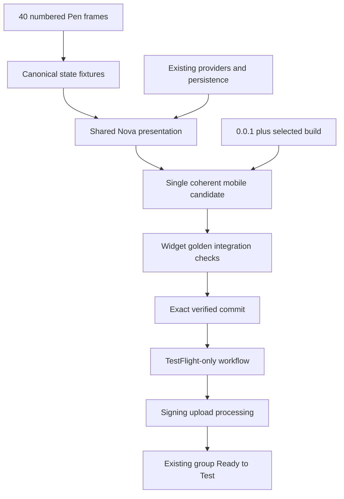

# feat: Align Woman in Red with Pen and ship 0.0.1 to TestFlight

## Goal Capsule

- Deliver one coherent Woman in Red mobile build that matches all 40 numbered product frames in the live Pen document at 393×852.
- Preserve the existing VPN, profile, routing, diagnostics, and Auto Mode behavior while replacing mixed Hiddify/Material presentation with the Nova presentation.
- Reset the beta marketing version to `0.0.1`, assign the first available positive build number starting at `1`, and deliver the exact tested commit through TestFlight only.
- Stop only for a real external gate such as protected-environment approval, unavailable signing credentials, Apple processing failure, or Beta App Review.

---

## Product Contract

### Summary

The current TestFlight candidate starts on Home, presents an oversized generic no-access recovery card, exposes an expert server setup action, renders Settings and Routing with old Hiddify/Material structure, and collapses some import failures into an unhelpful unexpected error. The target is the complete numbered Pen product surface, not the exploratory design-system, coverage-review, or concept frames.

### Problem Frame

The app already contains most underlying behavior and several hardened failure states, but the product surface is inconsistent. A partial visual migration would leave users moving between incompatible interaction models. The release must therefore be a single coherent candidate whose first-run path lets a tester reach subscription import immediately and whose functional state transitions remain backed by real providers and persistence.

### Requirements

**Pen parity and behavior preservation**

- R1. Implement the 40 numbered Pen frames: 01; 02, 02a–02f; 03–18; 04a–04b; 19a–19c; 20–25; and 35–39.
- R2. Exclude Design System, Coverage Review, Concept 01, and Concept 02.
- R3. Preserve real runtime data and existing VPN, profile, routing, diagnostics, update, and Auto Mode logic; mock values in Pen must never replace real version, server, protocol, latency, traffic, or connection data.
- R4. Restore onboarding with Welcome → import as the primary path and a visible “later” path; first-run gating must not swallow incoming deep links.
- R5. Replace the Home no-access recovery card with the compact Pen composition and remove “Настроить свой VPN-сервер (для опытных)” from the user-facing flow.
- R6. Render Settings, Routing, editors, technical settings, profile/server surfaces, import outcomes, diagnostics, post-update, and Auto Mode outcomes in the Nova visual language while keeping existing callbacks and persistence.
- R7. Import errors must be actionable and safely categorized without disclosing subscription URLs, tokens, credentials, or unsafe network details.

**Versioning and migration**

- R8. Set the marketing version to `0.0.1` across Flutter, Runner, Packet Tunnel, RunnerTests, Android, and MSIX.
- R9. Set build `1` by default and keep marketing version unchanged on later uploads while incrementing build only.
- R10. Marketing version and build number must be independently selectable in release tooling.
- R11. Migration from `4.1.2+40102` to `0.0.1+1` is a beta numbering reset: it must not show a false post-update outcome and must not delete or reset user data. A later `0.0.1+2` update remains detectable.
- R12. If build `1` already exists in App Store Connect, delivery must select the next unused build automatically.

**TestFlight delivery**

- R13. Add a manual TestFlight-only workflow that runs on an explicit ref/commit, builds and signs iOS only, uses the existing protected signing/publishing environments, and never creates a GitHub Release or uploads Android.
- R14. Upload the exact verified commit, preserve the existing TestFlight group, and add no testers.
- R15. Delivery is complete only after Apple processing and a confirmed `0.0.1 (<build>)` Ready to Test status, or after reporting the exact external approval/review gate.

**Verification**

- R16. Every one of the 40 canonical frames has a deterministic production-widget fixture or golden at 393×852 using Russian copy and injected state rather than a disconnected mock-only screen.
- R17. Cover text scale 1.5× and 2×, keyboard, safe areas, overflow, contrast, and interactive hit areas.
- R18. Exercise onboarding, deep links, import, all connection states, profiles, servers, routing drafts/failures, diagnostics, post-update, and Auto Mode outcomes.
- R19. A physical iPhone run must cover Intro → import → Home → Servers → Rules → Settings and capture factual screenshots from the TestFlight build.
- R20. Packet-tunnel functionality is verified separately on the physical device; visual or simulator success is not VPN proof.

### Scope Boundaries

In scope: mobile presentation and state integration for the numbered frames; release versioning; migration protection; TestFlight-only automation; golden/widget/integration checks; signed iOS delivery.

Outside scope: redesigning the VPN core, adding self-hosting functionality, new testers or TestFlight groups, Android/Google Play delivery, GitHub Release publication, and exploratory Pen frames.

### Acceptance Examples

- AE1. Given a clean install, when the app starts, then Intro appears; choosing import opens the subscription import path, while “later” opens Home without losing future import access.
- AE2. Given no profile, when Home renders at 393×852, then it matches Pen frame 02d, contains one primary add-access action, and contains no expert server setup action.
- AE3. Given a valid subscription URL, when import completes, then checking and success states match 19a/19c and the imported access remains available after relaunch.
- AE4. Given an unsafe, invalid, network-failing, or cancelled import, when the outcome renders, then 19b shows a specific safe action and never reveals the submitted URL or credentials.
- AE5. Given existing preferences and profile data from `4.1.2+40102`, when `0.0.1+1` starts, then data remains and no post-update outcome appears; when `0.0.1+2` starts later, normal update detection still works.
- AE6. Given build `1` is occupied, when the TestFlight workflow runs, then it uploads `0.0.1` with the next free build and reports that selected build.
- AE7. Given the workflow upload succeeds, when Apple finishes processing, then the existing TestFlight group shows `0.0.1 (<build>)` Ready to Test without adding testers.

---

## Planning Contract

### Key Technical Decisions

- KTD1. session-settled: Ship complete numbered-frame parity in one candidate; reject a partial mixed UI because the user explicitly requires no intermediate hybrid build.
- KTD2. session-settled: Keep existing providers, notifiers, storage, callbacks, and core integration; reject a functional rewrite because current hardened behavior already covers the required state machine.
- KTD3. session-settled: Use the live Pen document as the visual authority and production state as the data authority; reject copying illustrative values from Pen.
- KTD4. session-settled: Use one marketing version plus an independent monotonic build; reject semver-derived build arithmetic because repeated TestFlight uploads need `0.0.1 (2)`, `(3)`, and later.
- KTD5. session-settled: Create a TestFlight-only manual workflow; reject the release-tag flow because it also publishes GitHub and Google Play.
- KTD6. Keep the existing four-tab Nova dock and build the remaining surfaces from a small shared set of existing Nova tokens, grouped containers, rows, headers, state cards, and action controls. Do not add a new UI framework or dependency.
- KTD7. Treat first-run completion independently from app-version migration so the beta version reset cannot replay onboarding for existing users or erase stored state.
- KTD8. Resolve the free TestFlight build immediately before archive/upload using App Store Connect data or the existing Apple upload tooling, with `1` as the floor and no marketing-version mutation.

### High-Level Technical Design

### Implementation Sequencing

Establish version/release contracts and shared Nova primitives first. Onboarding/import, Home/profile/servers, and Settings/routing can then proceed as disjoint vertical slices over existing state logic. Integrate the remaining diagnostic/update states, run the complete fixture matrix, and only then create and upload the release commit.

---

## Implementation Units

### U1. Version, migration, and TestFlight-only contract

- **Goal:** Make `0.0.1` and independent build selection safe and deliverable without triggering other release channels.
- **Requirements:** R8–R15; AE5–AE7.
- **Dependencies:** None.
- **Files:** `pubspec.yaml`, `ios/Runner.xcodeproj/project.pbxproj`, `windows/runner/Runner.rc` or the owning MSIX manifest, `.github/change_version.sh`, `.github/workflows/signed-release.yml`, `.github/workflows/testflight.yml`, `lib/features/app_update/notifier/post_update_notifier.dart`, `test/features/app_update/notifier/post_update_notifier_test.dart`, workflow/version contract tests under `test/brand/` or `.github/`.
- **Approach:** Separate marketing/build inputs at the existing release seam; synchronize platform metadata; preserve downgrade-as-baseline behavior; add a workflow-dispatch wrapper and a target selector that permits iOS build/upload while gates disable GitHub and Google jobs; select the free build before archive.
- **Execution note:** Add migration and workflow-contract checks before changing their implementation.
- **Patterns to follow:** Existing `signed-release.yml`, App Store signing environments, `test/brand/rebrand_config_test.dart`, and post-update notifier tests.
- **Test scenarios:** Exact platform version values; `4.1.2+40102 → 0.0.1+1` baseline without dialog/data reset; `0.0.1+1 → 0.0.1+2` normal update; occupied build `1` selects next; workflow target excludes GitHub and Google jobs.
- **Verification:** Static contracts agree, migration tests pass, and a dry workflow evaluation shows only iOS/TestFlight jobs for an explicit ref.

### U2. Shared Nova parity harness

- **Goal:** Provide the smallest reusable production presentation and deterministic fixture registry needed by the 40 frames.
- **Requirements:** R1–R3, R16–R18.
- **Dependencies:** None.
- **Files:** existing files under `lib/core/theme/`, `lib/core/widget/`, a frame-fixture registry under `test/fixtures/` or `test/features/nova/`, and golden/widget harness files under `test/goldens/`.
- **Approach:** Extend existing Nova tokens/scaffold/dock rather than introducing a new design system. Map each Pen frame ID to the production route/widget and injected provider state. Keep platform-specific frames guarded by platform capability.
- **Execution note:** Start with one failing fixture completeness test listing all 40 canonical IDs.
- **Patterns to follow:** `nova_tokens.dart`, `nova_grouped_scaffold.dart`, `nova_glass_tab_bar.dart`, and existing connection-state widget tests.
- **Test scenarios:** Fixture set equals the 40-frame allowlist; every fixture renders at 393×852; Russian scale 1.0/1.5/2.0 has no overflow; primary actions meet hit-area/semantics checks; keyboard and safe-area fixtures remain visible.
- **Verification:** The fixture completeness and shared accessibility/layout suite pass with no exploratory frames included.

### U3. First-run onboarding and subscription import

- **Goal:** Restore a reliable first-run Welcome → import flow and Pen import outcomes with safe actionable errors.
- **Requirements:** R4, R5, R7, R16–R18; AE1–AE4.
- **Dependencies:** U2.
- **Files:** `lib/core/preferences/`, `lib/core/router/go_router/`, `lib/features/intro/`, `lib/features/loading/widget/bootstrap_root.dart`, `lib/features/profile/add/`, `lib/features/profile/notifier/profile_notifier.dart`, `lib/core/router/bottom_sheets/`, Russian translations, and matching router/import/widget tests.
- **Approach:** Restore a persisted first-run flag and Intro route without consuming pending deep links. Keep clipboard/file/QR/manual parsing and security policy; improve error mapping at the shared import boundary; render checking/error/success using Nova production widgets. Remove the expert self-host action from all intended no-access/import surfaces.
- **Execution note:** Characterize incoming-link startup and each import error category before changing routing or presentation.
- **Patterns to follow:** Existing link parsers, profile download policy, import phase state machine, deep-link confirmation, and previous Intro implementation where compatible.
- **Test scenarios:** Clean first launch; “later”; import CTA; pending deep link before onboarding; valid HTTPS subscription; invalid syntax; unsafe destination; DNS/network failure; parsing failure; cancel/retry; no secret material in copy or logs; relaunch persistence.
- **Verification:** Router, import-flow, security, fixture, and localization tests pass for frames 01, 19a–19c, and their handoffs.

### U4. Home, profile, servers, and Auto Mode

- **Goal:** Align frames 02–06 and 36–39 while preserving actual connection/profile/proxy behavior.
- **Requirements:** R1–R3, R5–R6, R16–R18; AE2–AE4.
- **Dependencies:** U2, U3.
- **Files:** `lib/features/home/`, `lib/features/identity/`, `lib/features/profile/details/`, `lib/features/profile/overview/`, `lib/features/proxy/overview/`, related bottom sheets and tests.
- **Approach:** Replace Home recovery presentation and harmonize real disconnected/connecting/connected/error/provider/checking states. Restyle profile/list/detail/export/delete and server/Auto outcomes around existing providers, activation actions, and selection rollback guarantees.
- **Execution note:** Use provider overrides to test each production state before visual changes.
- **Patterns to follow:** Existing Nova hero/control/protection widgets, profile state objects, `AutoModeSelector`, and profile export/delete tests.
- **Test scenarios:** All seven Home states; no-access CTA count; active profile and real metadata; stopped service; real empty group; unknown subscription metadata retry/local fallback; export/delete confirmation; Auto confirmation/no candidates/failure/success with selection preservation.
- **Verification:** Frames 02–06 and 36–39 render through production widgets and all existing behavior tests remain green.

### U5. Settings, routing, editors, and technical sections

- **Goal:** Align frames 07–16, 20, 22, and 35 with grouped Nova presentation without changing setting semantics or draft persistence.
- **Requirements:** R1–R3, R6, R16–R18.
- **Dependencies:** U2.
- **Files:** `lib/features/settings/overview/`, `lib/features/route_rules/`, `lib/features/per_app_proxy/`, `lib/features/chain/`, relevant navigation and tests.
- **Approach:** Expose existing technical routes from the grouped Settings index; replace the old Routing bottom sheet with the Pen root composition; restyle rule/list/per-app/DNS/inbound/TLS/chain/advanced screens while preserving notifiers, platform gates, import/export/reset actions, and unsaved-change guards.
- **Execution note:** Add characterization coverage for routing draft/save-failure and Android permission denial before replacing presentation.
- **Patterns to follow:** Existing rule draft notifier, route save boundary, unsaved changes guard, platform capability checks, and grouped Nova scaffold.
- **Test scenarios:** Settings navigation; rule/global segment; reorder and edit; failed save retains draft; list editor; Android permission denied retry with saved rules intact; DNS/inbound/TLS/chain value persistence; 2× text scale and keyboard editors.
- **Verification:** Frames 07–16, 20, 22, and 35 pass route, persistence, layout, and accessibility checks.

### U6. Logs, About, diagnostics, and update outcome

- **Goal:** Complete frames 17, 18, 23, and 24 using real version/state and safe diagnostic data.
- **Requirements:** R1–R3, R6, R8, R11, R16–R18.
- **Dependencies:** U1, U2.
- **Files:** `lib/features/log/`, `lib/features/about/`, `lib/features/diagnostics/`, `lib/features/app_update/`, related tests and fixtures.
- **Approach:** Apply Nova composition without changing log collection, diagnostic redaction, navigation, or update semantics. About and update surfaces obtain actual package marketing/build values rather than Pen mock values.
- **Execution note:** Preserve and extend redaction tests before changing diagnostics presentation.
- **Patterns to follow:** Existing safe diagnostics objects, imperative diagnostic page flow, post-update gate, and package-info presentation.
- **Test scenarios:** Empty/populated logs; safe export; secrets and URLs redacted; diagnostic page transitions; actual `0.0.1 (<build>)`; beta reset suppression; later build update outcome.
- **Verification:** Frames 17, 18, 23, and 24 pass security, migration, fixture, and accessibility checks.

### U7. Integrated device candidate and TestFlight delivery

- **Goal:** Prove one coherent candidate, commit it once, upload the exact commit, and confirm it is testable.
- **Requirements:** R13–R20; AE1–AE7.
- **Dependencies:** U1–U6.
- **Files:** integration tests, golden baselines, workflow metadata, and factual screenshots/artifacts produced by the build; no product behavior is added here.
- **Approach:** Run generation, formatting, analysis, full tests, golden matrix, iOS archive/signing checks, and physical-device walkthrough. Create the final commit, push the branch, dispatch the TestFlight-only workflow on that exact ref, and monitor GitHub and App Store Connect through processing and group readiness.
- **Execution note:** This is release integration; no upload occurs until the working tree and verified commit match exactly.
- **Patterns to follow:** Existing signing candidate, packaged-core integration test, protected environments, and current TestFlight group.
- **Test scenarios:** Clean install walkthrough; upgrade preserving data; physical Intro → import → Home → Servers → Rules → Settings; factual screenshot comparison; actual packet tunnel connect/disconnect as a separate check; occupied build fallback; exact SHA in workflow; Ready to Test in existing group.
- **Verification:** Full local and CI evidence is green, the signed IPA upload is processed, App Store Connect reports `0.0.1 (<build>)` Ready to Test for the existing group, and physical screenshots/version diagnostics match the uploaded build.

---

## Verification Contract

| Scope | Evidence | Done signal |
|---|---|---|
| Static quality | Generation, formatting, analyzer, full Flutter tests | Fresh zero-error/zero-failure output |
| Pen parity | 40 fixture allowlist plus production-widget renders at 393×852 | Every canonical ID covered; exploratory IDs absent |
| Accessibility | Russian 1×/1.5×/2×, safe areas, keyboard, semantics, contrast/hit-area checks | No overflow or unreachable primary action |
| Functional flows | Router/import/profile/proxy/routing/diagnostic/update integration tests | Existing state and persistence guarantees remain green |
| iOS build | Signed archive/IPA for exact commit and selected build | Archive/export/upload jobs succeed |
| TestFlight | Apple processing and existing group assignment | `0.0.1 (<build>)` Ready to Test |
| Physical device | Walkthrough screenshots and separate packet-tunnel check | Actual installed TestFlight build verified; UI proof and VPN proof reported separately |

---

## Risk Analysis & Mitigation

- A full 40-frame visual sweep can accidentally fork behavior. Mitigation: production widgets and provider overrides, not a parallel demo app.
- Onboarding can consume or defer a deep link incorrectly. Mitigation: explicit startup-state tests for pending import before first-run completion.
- Version reset can be misread as downgrade or update. Mitigation: explicit migration baseline test and independent onboarding flag.
- App Store build lookup can race another upload. Mitigation: resolve immediately before archive/upload and fail clearly on conflict rather than mutate marketing version.
- Goldens can become cosmetic snapshots disconnected from runtime. Mitigation: each fixture instantiates the route’s production widget with injected real state types and a completeness registry.
- Simulator success cannot prove VPN operation. Mitigation: keep physical packet-tunnel verification a separate release gate and report signing/connection evidence explicitly.

---

## Definition of Done

- All 40 numbered Pen frames are represented by production-widget fixtures and the app no longer exposes a mixed old/new mobile presentation.
- Onboarding appears for a true first run, “later” works, deep links survive, and a tester can import a subscription with actionable safe outcomes.
- `0.0.1 (<build>)` is consistent across About, diagnostics, Flutter, iOS targets, Android, and MSIX.
- The beta version reset preserves user data and does not trigger a false post-update screen.
- The exact final commit is pushed on the feature branch and the TestFlight-only workflow creates no GitHub Release and no Google Play upload.
- Apple processing is complete and the existing TestFlight group shows Ready to Test, or the exact protected-environment/Beta Review gate is documented.
- A physical iPhone run and factual screenshots verify the installed TestFlight build; packet-tunnel connectivity is reported separately from visual readiness.
